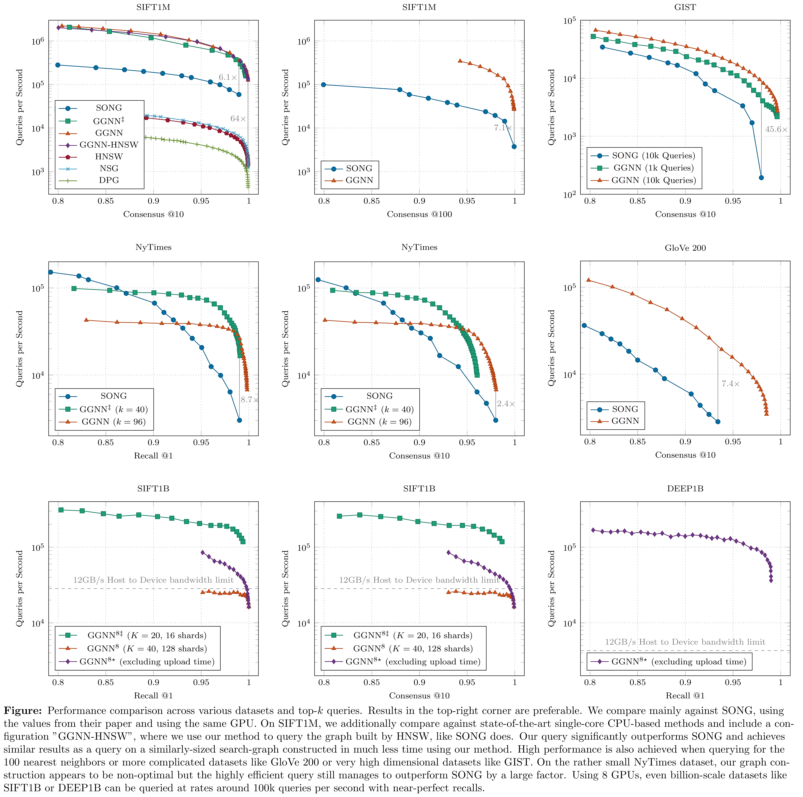

# GGNN: Graph-based GPU Nearest Neighbor Search
*Fabian Groh, Lukas Ruppert, Patrick Wieschollek, Hendrik P.A. Lensch

Approximate nearest neighbor (ANN) search in high dimensions is an integral part of several computer vision systems and gains importance in deep learning with explicit memory representations. Since PQT and FAISS started to leverage the massive parallelism offered by GPUs, GPU-based implementations are a crucial resource for today’s state-of-the-art ANN methods. While most of these methods allow for faster queries, less emphasis is devoted to accelerate the construction of the underlying index structures. In this paper, we propose a novel search structure based on nearest neighbor graphs and information propagation on graphs. Our method is designed to take advantage of GPU architectures to accelerate the hierarchical building of the index structure and for performing the query. Empirical evaluation shows that GGNN significantly surpasses the state-of-the-art GPU- and CPU-based systems in terms of build-time, accuracy and search speed.

---

# Update: 03/14/21
This work is currently under review. 
We've updated the code. Some new results are shown below.



## How to run the code?

```bash
# Get the repository and dependencies
git clone --recursive https://github.com/cgtuebingen/ggnn.git
cd ggnn

# get the SIFT1M data
cd data
./get_sift1m
cd ..

# Build the demo
mkdir build_local
cd build_local
cmake ..
make

# Example for SIFT1M on GPU 0:
./sift1m_multi  --base_filename ../data/sift/sift_base.fvecs 
                --query_filename ../data/sift/sift_query.fvecs 
                --groundtruth_filename ../data/sift/sift_groundtruth.ivecs 
                --gpu_ids="0"

# Example usage with 2 GPUs and 4 shards in total (4x250k = 1M):
./sift1m_multi  --base_filename ../data/sift/sift_base.fvecs 
                --query_filename ../data/sift/sift_query.fvecs 
                --groundtruth_filename ../data/sift/sift_groundtruth.ivecs 
                --gpu_ids="0 1" 
                --factor 10000 
                --base 100 
                --shard 25
```


### Native build

Requirements:
* CUDA (>10.2)
* libgflags-dev (`sudo apt install libgflags-dev`)


### Docker build
An alternative to the native build is to use nvidia-docker. Follow instruction on https://docs.nvidia.com/datacenter/cloud-native/container-toolkit/install-guide.html#installing-docker-ce

Prepare the docker image by

```bash
cd docker
make
cd ../
```

Make sure you can run

```bash
sudo docker run --gpus all cgtuebingen/ggnn:v1 nvidia-smi
```

Now build the code via

```bash
user@host $ sudo docker run --rm -it --user "$(id -u):$(id -g)" -v ${PWD}:/ggnn:rw --gpus all cgtuebingen/ggnn:v1 bash
user@container $ ./build.sh

cd build_docker
make
```

## More Resources

- [Arxiv Pre-Print](https://arxiv.org/abs/1912.01059)
